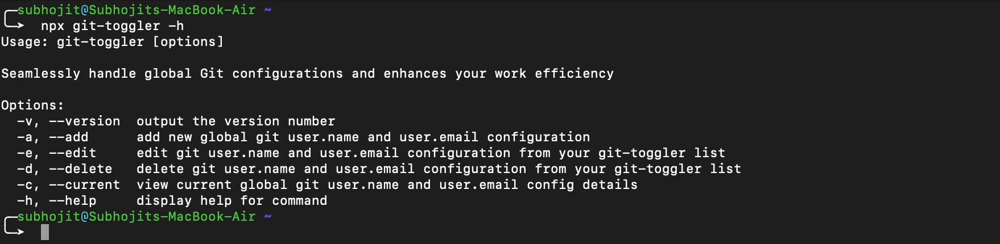

# Git Toggler

When you need to switch multiple github account you might need to configure your Git username/email like this below

```javascript
git config --global user.name "FIRST_NAME LAST_NAME"
git config --global user.email "MY_NAME@example.com"
```

Navigating this process repeatedly throughout your workdays can be quite cumbersome.

```git-toggler```  transforms feature toggle management by seamlessly integrating with Git and enabling effortless toggling between global configurations for your Git username and email. This tool streamlines the process, offering a centralized control mechanism for swift activation or deactivation of features. Its ability to seamlessly handle global Git configurations enhances efficiency, making it a valuable asset for developers seeking a hassle-free experience in managing feature toggles while maintaining control over their Git identity settings.


After you choose from the list ```git-toggler```. This will do below thing automatically.
```javascript
git config --global user.name "FIRST_NAME LAST_NAME"
git config --global user.email "MY_NAME@example.com"
```


### Install

```javascript
npm install -g git-toggler
```

### Usage

Using ```git-toggler``` is very simple. You can use this by install package globally or you can use ```npx``` 

```javascript
git-toggler
// OR
npx git-toggler
```

 ```git-toggler``` has lot's of useful parameter that you can find all by pass ```-h or --help``` 



### Outro

Dive into the dynamic flow of Git toggles and the exhilarating world of development. Fashioned with love by [Subhojit](https://subhojit.me/), where each line of code is a brushstroke of passion. ❤️